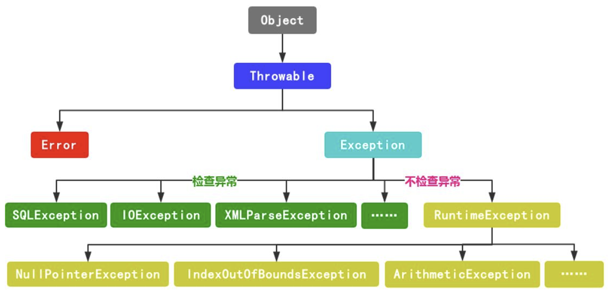
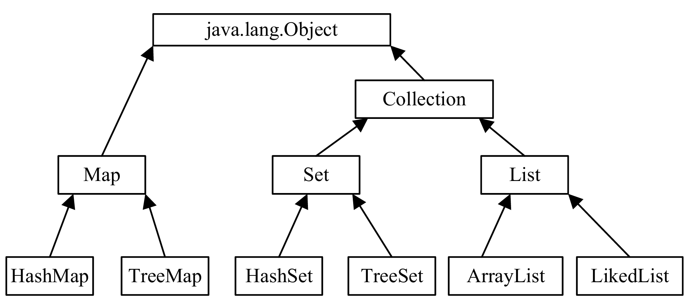
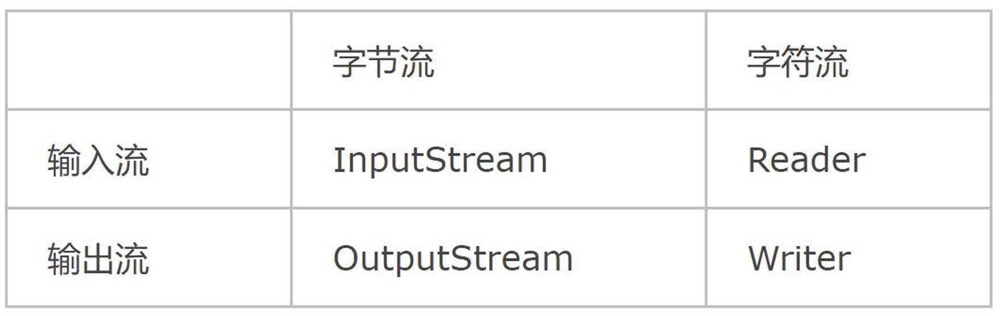

# <center>软件构造复习大纲

## <center>Java中的机制

### Java数据类型
1. 基本数据类型（数值型，字符型，布尔型） $\rightarrow$ 变量中直接存储的是数据本身的值。（栈内存）
2. 引用数据类型（类，接口，数组） $\rightarrow$ 变量中存储的是对象在内存中的地址。（堆内存）

### Java输入与输出
#### 标准输入System\.in
**System.in是一个InputStream（字节输入流）类的对象**，通常采用以下两种封装方式：

1. 使用字符流
```
BufferedReader stdin = new BufferedReader(new InputStreamReader(System.in));
System.out.print("enter a line:");
System.out.println(stdin.readLine());
```
2. 使用```java.util.Scanner```
```
Scanner stdin = new Scanner(System.in);
System.out.print("enter a line:");
System.out.println(stdin.nextLine());
```
#### 标准输出System.out
print和println的参数完全一样，不同之处在于println输出后换行而print不换行。write方法用来输出字节数组，在输出时不换行。

### Java异常机制
异常指不期而至的各种状况，如：文件找不到、网络连接失败、非法参数等。异常是一个事件，它发生在程序运行期间，干扰了正常的指令流程。Java通过API中Throwable类的众多子类描述各种不同的异常。

三种类型的异常：**检查性异常，运行时异常，错误。** 
其中，检查性异常和运行时异常的核心区别就在于编译时是否会受到编译器的强制检查


#### 问答题考点：throw和throws的用法
```
public static int getElement(int[] arr, int index) throws Exception,IOException { 
    if(arr==null) { 
        throw new NullPointerException("指针为空");
    }else if(index>=arr.length-1) {
        throw new ArrayIndexOutOfBoundsException("数组越界");
    } 
    int ele = arr[index]; 
    return ele;
}
```
- **共同点**：两者都是**消极处理异常的方式，只负责抛出异常**，但是不会由函数去处理异常，真正的处理异常由函数的上层调用处理
- **区别**：
  - throws用于方法头，表示的只是异常的申明；而throw用于方法内部，抛出的是异常对象；
  - throws可以一次性抛出多个异常，而throw只能抛出一个。

#### Java虚拟机
JVM是通过软件来模拟Java字节码的指令集，是Java程序的运行环境。其特点有：
1. 一次编译，到处运行；
2. 自动内存管理；
3. 自动垃圾回收功能。

#### Java垃圾回收
C语言和C++采用**显式分配器**将堆空间完全暴露给用户，优点在于功力深厚的程序员可以很好地利用堆空间内存。其缺点也很明显，每一次分配内存后都要手动释放，否则很容易引起内存泄漏。

Java的核心思想是面向对象，屏蔽了很多底层细节，让程序员更多地关注“对象”。Java使用**隐式分配器**，程序员只管创建对象使用**堆内存**，回收交给垃圾回收器。

Java的垃圾回收器在执行引擎中，垃圾回收的主要对象是**JVM堆空间**。

### 泛型与泛型类
Java泛型是Java5中引入的一个新特性，提供了编译时类型安全监测机制，该机制允许我们在编译时检测到非法的数据结构。
- 引入类型参数（type parameters），将所有操作的数据类型被指定为一个参数。
```
ArrayList<String> list = new ArrayList<>();
list.add("str");
String name = list.get(0);
```
#### 泛型类
泛型类（generic class）就是具有一个或多个类型参数的类。
- 语法格式：在类名之后声明泛型，泛型类先声明类型变量再使用。类型变量通常使用较短的大写，如 T, E, K, V等 。
声明单个泛型：
```
class Generic<T> { //声明类的泛型 <T>
    public T t; //变量t的类型为泛型T
    public Generic(){}
    public Generic(T t){ //传入参数的类型为T
        this.t = t;
    }
    public void fun1(T t) {}
    public T fun2(T t) {} //函数返回值为类型T
}
```
- 类型参数：类型参数（又称类型变量）作占位符，指示分配的类型，E：(Element) 元素，K：(Key) 键，N：(Number) 数字，T：(Type) 类型，V：(Value) 值
多个泛型类使用：
```
class Generic<T, E> {
    public T t;
    public E e;
    public void fun(T t, E e) {}
}
Generic<String, Integer> g3 = new Generic<>();
g3.t ="str";
g3.e = 100;
```
**注意，声明泛型不能使用基本数据类型，如int不行，需为Integer。**

#### 泛型方法
泛型方法可以定义在普通类中，也可以定义在泛型类中。泛型类中使用了泛型成员的方法不是泛型方法，只有声明泛型的方法才是泛型方法。
```
class Generic<T> {
    public T t;
    public <T> void func(T t) {}
}
```
```
非泛型类中定义泛型方法
class GenericFun{
    public <T,E> void fun1(E e){}
    public <T> T fun2(T t){
        return t;
    }
}
```
调用泛型方法时，在方法名前的尖括号中填入具体类型。
泛型类中定义泛型方法
```
class GenericFun<K>{
    public <T> T fun2(T t,K k){
        return null;
    }
}
```
**使用泛型方法，此处传入参数必须与泛型类声明的类型一致。**
但是，如果泛型方法的泛型与泛型类声明的泛型名称一致，则**泛型方法中的泛型会覆盖类的泛型。**
```
class GenericFun<K>{
    public <T,K> T fun2(T t, K k){
        return null;
    }
}
```
注意这里```public <T> T fun2(T t,K k)```和```public <T,K> T fun2(T t, K k)```的区别。
**类的静态泛型方法，不得使用泛型类中声明的泛型，可以独立声明。**
```
class GenericStaticMethod<K>{
    private K k;
    public GenericStaticMethod(K k){
        this.k=k;
    }
    public static GenericStaticMethod <K> fun1(K k){
        return new GenericStaticMethod <K>(k);
    }//报错：无法从静态上下文中引用非静态类型变量K
    public static <K> GenericStaticMethod<K> fun1(K k){
        return new GenericStaticMethod<K>(k);
    }//可以编译成功
    public static <T> GenericStaticMethod<T> fun1(T t){
    return new GenericStaticMethod<T>(t);
    }//写成另一种类型
}
```
#### 泛型接口
```
interface GenericInterface <T>{
    T fun1();
}
```
实现类非泛型类，需要具体指定接口的泛型
```
class GenericInterfaceImpl implements GenericInterface<String> {
    @Override
    public String fun1() {
        return null;
    }
}
```
实现类为泛型类，实现类的泛型要与接口一致
```
class GenericInterfaceImpl<T> implements GenericInterface<T> {
    @Override
    public T fun1() {
        return null;
    }
}
```
```
interface ShowInterface<T> { public void show(T t); }
//实现类是非泛型类，已确定类型
class ShowClass1 implements ShowInterface<String>{
    public void show(String t){
        System.out.println(“show:”+t);
    }
}
//实现类是泛型类，未确定类型
Class ShowClass2<T> implements ShowInterface<T>{
    public void show(T t){
        System.out.println("show:"+t);
    }
}
public static void main(String[] args) {
    //实现类已确定类型
    ShowClass1 obj = new ShowClass1();
    obj.show("java");
    //实现类未确定类型，使用时确定
    ShowClass2<Integer> obj = new ShowClass2<>();
    obj.show(6);
}
```
### 泛型的通配符
为什么需要通配符：考虑为所有List抽象一个方法，不论给的参数是List<\Integer>，List<\String>，都可以接收并且打印List中的元素。
```
public static void printAllObject(List<Object> list) {
    for (Object object : list) {
        System.out.println(object);
    }
}
public static void main(String[] args) {
    ArrayList<String> list1 = new ArrayList<>();
    list1.add(“java”);
    printAllObject(list1);
}
```
```
public static void printAllObject(List<?> list) {
    for (Object object : list) {
        System.out.println(object);
    }
}
public static void main(String[] args) {
    List<String> list1 = new Arraylist<>();
    List1.add(“java”);
    printAllObject(list1);
    List<Interger> list2 = new Arraylist<>();
    List2.add(7);
    printAllObject(list2);
}
```
**通配符**
- 允许类型参数发生变化
- \<? extends ClassName>：**类型参数是ClassName的子类。**<? extends T>上界通配符实例化的类必须是T类，或是T类的子类
- \<? super ClassName>：**类型参数是ClassName的超类。**<? super T>下界通配符实例化的类必须是T类，或是T类的超类
- \<?>：**无限定通配符。**

例：
```
public class WildCardExtendsDemo {
    public static void printAllObject(ArrayList<? extends Number> list) {
        for (Object object : list) {
            System.out.println(object);
        } 
    }
    public static void main(String[] args) {
        list1.add(1.23);
        ArrayList<Double> list1 = new ArrayList<>();
        printAllObject(list1);
    }   
}
```
```
public class WildCardSuperDemo {
    public static void printAllObject(ArrayList<? super Double> list) {
        for (Object object : list) {
            System.out.println(object);
        }  
    }
    public static void main(String[] args) {
        list1.add(7);
        ArrayList<Number> list1 = new ArrayList<>();
        printAllObject(list1);
    } 
}
```
注意：**参数类型T与通配符**
- T表示一个确定的类型，常用于泛型类和泛型方法的定义
- ?表示不确定的类型，不是类型变量，通常用于泛型方法的调用代码和形参，不能用于定义类和泛型方法。

### 反射
感觉不是很重要，先略。应该会结合单例模式来考察，可以看单例模式。


## <center>面向对象
**面向对象的三大特性：封装，继承和多态。**
### 简答题考点：面向对象与面向过程的优缺点
- 面向过程：
  - 优点：简单逻辑下快速开发，计算效率高
  - 缺点：灵活性差、无法适用复杂情况
- 面向对象：
  - 优点：低耦合、易复用、易扩展
  - 缺点：性能相对低
### 简答题考点：类与对象的关系
- 类是对象的抽象，是创建对象的模板（代表了同一批对象的共性与特征） 
- 对象是类的具体实例（不同对象之间还存在着差异）
- 同一个类可以定义多个对象（一对多关系）
- 类是**静态**的，类的存在、语义和关系在程序设计时（执行前）就已经定义好了。
- 对象是**动态**的，对象在程序执行时可以被创建，修改，删除。
### 简答题考点：封装的优点
- **安全性**：数据和数据相关的操作被包装成对象，可以控制数据的访
问权限。
- **高内聚**：一种对象只做好一件（或者一类相关的）事情，对象内部
的细节外部不关心也看不到。便于修改内部代码，提高可维护性。
- **低耦合**：不同种类的对象间相互的依赖尽可能地降低。简化外部调
用，便于调用者使用，便于扩展和协作。
- **可复用性**：面向对象编程的主要目的是方便程序员组织和管理代码，
快速梳理编程思路，带来编程思想上的革新。
### 类的构造方法
构造方法是用于创建类对象的特殊方法。它的主要作用是初始化对象的属性，确保对象在创建时处于合法的初始状态。构造方法的特点包括：
- 方法名必须与类名相同。
- 没有返回类型（包括void）。
- 只能通过new关键字调用，不能像普通方法那样直接调用。
- 支持重载，可以根据参数列表的不同定义多个构造方法。
- 构造方法不能被static修饰，也不能被子类继承，但子类可以通过super()调用父类的构造方法。
```
public class Person {
   private String name;
   private int age;
   // 构造方法
   public Person(String name, int age) {
       this.name = name;
       this.age = age;
   }
}
```
#### this关键字
代表当前对象的引用。只能在类的实例方法或构造方法内使用，指向调用该方法的那个对象实例。
```this.name = name```，前面的```name```是类中```private String name```语句定义的私有变量。后面的是构造方法中的参数。
通过构造方法中```this.name = name```语句对私有变量```name```进行了赋值。

### 子类的构造方法
子类不能直接extends继承父类的构造方法，子类使用super语句来继承父类的构造方法。

#### 问答题考点：关键字super和this的区别
- 相同：
  - 指向对象实例​：都指向一个对象实例，​不能在 static 上下文（静态方法、静态块）中使用。
  - ​调用构造器​：都可用于构造方法中，调用其他构造器 (this(...) 调用本类，super(...) 调用父类)。

- 不同：
  - 指代对象: 当前类实例​ (自己)  V.S.  父类部分实例​ (父类)
  - ​存在前提: ​任何对象都存在  V.S.  必须存在继承关系
  - 主要用途：解决成员与局部变量同名冲突  V.S. 调用父类构造器

### static修饰符
含义：表明该属性、方法是**属于类**的，称为**静态属性**或**静态方法**。
- 静态成员属于类所有，不属于某一具体对象私有；
- 静态成员随类加载时被静态地分配内存空间、方法的入口地址。

例：
```
public class Person { 
    private String name; 
    private int age; 
    static String city = “深圳"; 
    public Person(String name, int age) { 
        this.name = name; 
        this.age = age; 
    } 
} 
// 调用
Person.city; //类名.属性
```
用static将city属性设置成一个公共属性。由于全局属性拥有可以通过类名称直接访问的特点，所以这种属性又称为类属性。

注意:
- 使用static声明的方法，不能访问非static的操作（属性或方法）
- 非static声明的方法，可以访问static声明的属性或方法

原因:
- 如果一个类中的属性和方法都是非static类型的，一定要有实例化对象才可以调用
- static声明的属性或方法可以通过类名访问，可以在没有实例化对象的情况下调用

**静态属性被所有的对象所共享，在内存中只有一个副本，它当且仅当在类初次加载时会被初始化，非静态属性是对象所拥有的，在创建对象的时候被初始化，存在多个副本，各个对象拥有的副本互不影响。**

### 接口与抽象类

#### 抽象类
简单说，拥有抽象方法的类就是抽象类。抽象类是不能实例化的作用：抽象方法实际上相当于定义了“规范”，只能被继承，保证子类实现其定义的抽象方法可用于实现多态。
例：
```
//定义一个抽象类  
public abstract class Person{
    //普通方法  
    public String getName()
    {
       return name;
    }
    //抽象方法  
    //没有方法体，用abstract做修饰  
    public abstract void getMission();
}
Person P = new Person(); 
// 编译错误，抽象类不能实例化
```
```
public class Student extends Person{
    public void getMission(){
        System.out.println("为中华之崛起而读书");  
    }
 }
```
#### 接口
比抽象类还要抽象：没有字段，所有方法都是抽象方法。
例：
```
interface Person{
    void getDuty();
    void getMission();
}
```
实现：
```
public class Student implements Person{
    private String name;
    private int age;
    @Override
    public void getDuty(){
        System.out.println("好好学习");  
    }
    @Override
    public void getMission(){
        System.out.println("为中华之崛起而读书");  
    }
}
```
#### 问答题考点：接口与抽象类的区别
- 抽象方法上，两者都可以定义抽象方法；
- 字段上，抽象类可以定义字段，而接口无字段；
- 继承上，抽象类只能extends一个class，而接口可以implements多个interface。

### Java中多继承问题
Java原则上只允许单继承，但是其提供了两种方法让我们实现多继承：**内部类和接口。**

#### 内部类实现
内部类：在类内部不仅可以定义成员变量和方法，还可以定义另一个类。如果在类A的内部再定义一个类B，则B类就称为内部类，而A类则称为外部类。内部类可以实现很好的隐藏，并且拥有外部类的所有元素的访问权限。
内部类例：
```
public class Father{  
    public int strong(){  
        // 强壮指数  
        return 9;  
    }  
}
public class Mother{  
    public int smart(){  
        // 聪慧指数  
        return 8;  
    }  
}
```
创建son类：
```
public class Son {  
    // 内部类继承Father类  
    class Father_Inner extends Father {  
        public int strong() {  
            return super.strong() + 1;  
        }  
    }
    // 内部类继承Mother类   
    class Mother_Inner extends Mother {  
        public int smart() {  
            return super.smart() + 2;  
        }  
    }   
    public int getStrong() {  
        return new Father_Inner().strong();
    }  
    public int getSmart() {  
        return new Mother_Inner().smart(); 
    } 
}   
```
#### 接口实现
Java中接口可以继承多个接口。
```
public interface Father{  
    public void strong();  
}  
  
public interface Mother{  
    public void smart();  
}  
  
public interface Daughter extends Father, Mother{  
    public void kind();  
}  
```
```
public class Girl implements Daughter{  
    public static void main(String[] args){
    }  
    @Override  
    public void strong(){  
        System.out.println(“She’s not strong.");  
    }  
    @Override  
    public void smart(){  
        System.out.println(“She’s very smart.");  
    }  
    @Override  
    public void kind(){  
        System.out.println(“She’s very kind.")  
    }  
}
```

## <center>数组与集合
### 问答题考点：数组与集合的区别
集合类与数组不同之处是，数组的长度是固定的，集合的长度是可变的；数组用来存放基本类型的数据和对象的引用，集合只能用来存放对象的引用。

### 数组
略

### 集合
#### 集合中的接口继承关系

#### List接口
List接口定义了一个有序的对象集合，允许重复元素存在。ArrayList 类是一个可以动态修改的数组，与普通数组的区别就是它是没有固定大小的限制，我们可以添加或删除元素。
##### ArrayList的使用
导入：```import java.util.ArrayList```
初始化：```ArrayList<E> objectName = new ArrayList<E>();```其中，E为泛型数据类型，只能为引用数据类型。
基本操作：
- 增加：.add()，可以指定具体位置
- 删除：.remove()
- 修改：.set()，第一个参数为索引位置，第二个参数为要修改的值
- 访问：.get()
- 计算大小：.size()

##### LinkedList的使用
与 ArrayList 相比，LinkedList 的增加和删除的操作效率更高，而查找和修改的操作效率较低。一个单向链表包含两个值: 当前节点的值和一个指向下一个节点的链接。
导入：```import java.util.LinkedList```
初始化：```LinkedList<E> objectName = new LinkedList<E>();```其中，E为泛型数据类型，只能为引用数据类型。
基本操作类似ArratList，只是LinkedList可以直接获取首尾元素。

#### Set接口
- Set集合中的对象不按特定的方式排序，只是简单地把对象加入集合中，但**Set集合中不能包含重复对象。**
- Set集合由Set接口和Set接口的实现类组成。Set接口继承了Collection接口，因此包含Collection接口的所有方法。
导入：```import java.util.HashSet```
初始化：```HashSet<E> objectName = new HashSet<E>();```其中，E为泛型数据类型，只能为引用数据类型。
基本操作：
- 添加元素：.add()
- 判断元素是否存在:.contains()
- 删除元素：.remove()
- 计算元素数量：.size()

#### Map接口
Map接口提供了将key映射到value的对象。**一个映射不能包含重复的key，每个key最多只能映射到一个value。**
导入：```import java.util.HashMap```
初始化：```HashMap<E,T> objectName = new HashMap<E,T>();```HashMap 的 key 与 value 类型可以相同也可以不同，可以是字符串（String）类型的 key 和 value，也可以是整型（Integer）的 key 和字符串（String）类型的value。key不允许直接使用基本数据类型，必须是对象类型（引用类型）。
基本操作：
- 添加：.put(key, value)
- 访问：.get(key)
- 删除：.remove(key), .clear()
- 计算大小：.size()

## <center>设计模式
面向对象设计原则：
- 单一职责原则：就一个类而言，应该仅有一个引起它变化的原因。
- 开闭原则：一个软件实体应当对扩展开放，对修改关闭。
- 依赖倒转原则：针对接口编程，不要针对实现编程。

### <center>设计模式的分类
1. 按照目的来分
    - 创建型模式（工厂方法，抽象工厂，单例）
    - 结构型模式
    - 行为型模式（模板方法，迭代器，观察者，策略）
2. 根据范围来分
    - 类（工厂方法，模板方法）
    - 对象（抽象工厂，单例，迭代器，观察者，策略）

### <center>单例模式
**保证一个类仅有一个实例，并提供一个访问它的全局访问点**

#### （1）饿汉式
```
public class Singleton{
    private static Singleton singleton01 = new Singleton(); // 天然线程安全

    private Singleton{}

    public static Singleton getInstance(){
        return singleton01;
    }
}
```
缺点：会造成内存浪费。
#### （2）懒汉式
```
public class Singleton{
    private static Singleton singleton02;

    private Singleton(){}

    public static Singleton getInstance(){
        if (singleton02 == NULL){
            singleton02 = new Singleton();
        }
        return singleton02;
    }
}
```
缺点：可能会创建多个实例。
**解决方法一：加入同步锁**
```
public class Singleton{
    private static Singleton singleton02;

    private Singleton(){}

    public static synchronized Singleton getInstance(){ // 线程安全，但是效率低
        if (singleton02 == NULL){
            singleton02 = new Singleton();
        }
        return singleton02;
    }
}
```
**解决方法二：双重检验锁**
```
public class Singleton{
    private static Singleton singleton02;

    private Singleton(){}

    public static Singleton getInstance(){
        if (singleton02 == NULL){
            synchornized (Singleton.class){
                if (singleton02 == NULL){
                    singleton02 = new Singleton();
                }
            }
        }
        return sigleton02;
    }
}
```
#### 利用反射破坏单例
通过反射中的```setAccessible(true)```覆盖Java中的访问控制，进而调用私有的构造函数。

**抵御反射破坏**

```
public class Singleton{
    private static Singleton singleton = new Singleton();

    private Singleton{
        if (singleton != NULL){
            throw new RuntimeException("单例构造器禁止通过反射调用");
        }
    }
    public static Singleton getInstance(){
        ...
        return singleton;
    }
}
```
### <center>简单工厂模式

#### UML类图


#### 代码实现
```
public interface Car{
    void showTheBrand();
}
```
```
public class Audi implements Car{
    @override
    void showTheBrand(){
        system.out.println("Audi");
    }
} 
```
```
public class BMW implements Car{
    @override
    void showTheBrand(){
        system.out.println("BMW");
    }
} 
```
```
public class Benz implements Car{
    @override
    void showTheBrand(){
        system.out.println("Benz");
    }
} 
```
```
public class SimpleFactory{
    public static Car giveMeACar(String brandName){
        if ("BMW".equals(brandName)){
            return new BMW();
        }
        if ("Benz".equals(brandName)){
            return new Benz();
        }
        if ("Audi".equals(brandName)){
            return new Audi();
        }
        return null;
    }
}
```


### <center>工厂模式

#### UML类图
在简单工厂的基础上加上新的工厂：


#### 代码实现
```
public interface Car{
    void showTheBrand();
}
```
```
public class Audi implements Car{
    @override
    void showTheBrand(){
        system.out.println("Audi");
    }
} 
```
```
public class BMW implements Car{
    @override
    void showTheBrand(){
        system.out.println("BMW");
    }
} 
```
```
public class Benz implements Car{
    @override
    void showTheBrand(){
        system.out.println("Benz");
    }
} 
```
```
public interface CarFactory{
    Car buildACar();
}
```
```
public class BMWFactory implements CarFactory{
    @override
    Car buildACar(){
        return new BMW();
    }
}
```
```
public class BenzFactory implements CarFactory{
    @override
    Car buildACar(){
        return new Benz();
    }
}
```
```
public class AudiFactory implements CarFactory{
    @override
    Car buildACar(){
        return new Audi();
    }
}
```
```
public class FactoryTest{
    public static void main(String[] args){
        BMWFactory carfactory = new BMWFactory();
        Car mayCar = carFactory.buildACar();
        mayCar.showTheBrand();
    }
}
```
优点：
利于扩展和维护，比如新增加一种车，只需要对应创建具体产品类和负责生产新品种车的具体工厂即可。符合“开闭原则”，便于扩展。
缺点：
不支持等级。
### <center>抽象工厂模式
**主要用于解决“一类产品”的创建问题**，与工厂方法模式的区别：
1. 工厂方法模式只有一个抽象产品类，而抽象工厂模式有多个。
2. 工厂方法模式的具体工厂类只能创建一个具体产品类的实例，而抽象工厂模式可以创建多个。
#### UML类图

#### 代码实现
```
public interface AbstractCarFactory{
    BClassCar build_B_ClassCar();
    CClassCar build_C_ClassCar();
}
```
```
public interface BClassCar{
    void showClassB();
}
```
```
public interface CClassCar{
    void showClassC();
}
```
具体实现省略
```
public class AbtractFactoryTest{
    public static void main(String[] args){
        BMWFactory bmwFactory = new BMWFactory();
        BenzFactory benzFactory = new benzFactory();

        bmwFactory.build_B_ClassCar().showClassB();
    }
}
```
优点：
1. 隔离了具体类的生成，将创建和使用解耦。
2. 添加新的产品族很方便，无需修改已有系统，符合“开闭原则”。
缺点：
1. 增加新的产品等级很麻烦，违背了“开闭原则”。

### <center>策略模式
**定义一系列的算法,把每一个算法封装起来, 并且使它们可相互替换，从而使得算法可独立于使用它的客户而变化。并将逻辑判断移到Client中去（即由客户端决定在什么情况下使用什么具体策略）。**

策略模式的三个基本角色：
1. 抽象策略角色：通常由一个接口或抽象类实现，此角色给出所有的具体策略类所需要的接口。
2. 具体策略角色：包装了相关算法或行为。
3. 环境角色：持有一个策略的引用。

#### UML类图


#### 代码实现
例子：假设现在要设计一个卖书的电子商务网站，本网站可能对所有的高级会员提供每本20％的促销折扣；对中级会员提供每本10％的促销折扣；对初级会员没有折扣。根据描述，折扣是根据以下的几个算法中的一个进行的：
- 算法一：对初级会员没有折扣。
- 算法二：对中级会员提供10％的促销折扣。
- 算法三：对高级会员提供20％的促销折扣。
```
//抽象策略类
public interface MemberStrategy{
    public double calcPrice(double booksPrice);
}
```
```
//具体策略1
public class PrimaryMemberStrategy implements MemberStrategy{
    @override
    public double clacPrice(double booksPrice){
        return booksPrice;
    }
}
```
```
//具体策略2
public class IntermediateMemberStrategy implements MemberStrategy{
    @override
    public double clacPrice(double booksPrice){
        return 0.9 * booksPrice;
    }
}
```
```
//具体策略3
public class AdvancedMemberStrategy implements MemberStrategy{
    @override
    public double clacPrice(double booksPrice){
        return 0.8 * booksPrice;
    }
}
```
```
public class Network { //持有一个具体的策略对象 
    private MemberStrategy strategy; 
    public Network(MemberStrategy strategy){ 
        this.strategy = strategy; 
    } 

    public double quote(double booksPrice){   
        return this.strategy.calcPrice(booksPrice); 
    } 
} 
```
```
public class Client{
    public static void main(Srting[] args){
        MemberStrategy strategy = new AdvancedMemberStrategy();
        Network network = new Network(strategy);
        double quote = network.quote(300);
        System.out.println(quote);
    }
}
```
优点：
- 提供了一种替代继承的方法，而且既保持了继承的优点（代码重用）还比继承更灵活（算法独立，可以任意扩展）。
- 它把采取哪一种算法或采取哪一种行为的逻辑与算法本身分离，避免程序中使用多重条件转移语句，使系统更灵活，并易于扩展。
- 遵守大部分设计原则，高内聚、低偶合。
  
缺点：
- 客户端必须知道所有的策略类，并自行决定使用哪一个策略类。这就意味着客户端必须理解这些算法的区别，以便适时选择恰当的算法类。换言之，策略模式只适用于客户端知道算法或行为的情况。
- 由于策略模式把每个具体的策略实现都单独封装成为类，如果备选的策略很多的话，那么对象的数目就会很可观。

### <center>迭代器模式
**在客户访问类与聚合类之间插入一个迭代器，这分离了聚合对象与其遍历行为，对客户也隐藏了其内部细节，且满足“单一职责原则”和“开闭原则”。**
提供一种方法顺序访问一个聚合对象中各个元素, 而又无须暴露该对象的内部表示。
#### UML类图


### <center>数据访问对象模式
数据访问对象模式的参与者：
- 数据访问对象接口：定义了在一个模型对象上要执行的标准操作。
- 数据访问对象实体类：实现接口，负责从数据源获取数据。
- 模型对象/数值对象：简单的普通对象，包含了get/set方法来存储通过使用DAO类检索到的数据。

优点：隔离数据层
缺点：代码量增加

#### UML类图


#### 代码实现
**Step 1:创建数值对象**
```
public class Student{
    private String name;
    private int rollNo;

    Student(String name, int rollNo){
        this.name = name;
        this.rollNo = rollNo;
    }
    public String getName(){
        return name;
    }
    public int getRollNo(){
        return rollNo;
    }
    public String setName(String name){
        this.name = name;
    }
    public int setRollNo(int rollNo){
        this.rollNo = rollNo;
    }
}
```
**Step 2:创建数据访问对象接口**
```
public interface StudentDao{
    List<Student> getAllStudents();
    Student getStudent(int rollNo);
    void updateStudent(Student student);
    void deleteStudent(Student student);
}
```
**Step 3:创建数据访问对象实体类**
```
public class StudentDaoImpl implements StudentDao {
 //列表是当作一个数据库
    List<Student> students;

    public StudentDaoImpl() {
        students = new ArrayList<Student>();
        Student student1 = new Student("Robert", 0);
        Student student2 = new Student("John", 1);
        students.add(student1);
        students.add(student2);
    }
    @Override
    public void deleteStudent(Student student) {
        students.remove(student.getRollNo());
        System.out.println("Student: Roll No " + student.getRollNo() + ",deleted from database");
    }
    //从数据库中检索学生名单
    @Override
    public List<Student> getAllStudents() {
        return students;
    }

    @Override
    public Student getStudent(int rollNo) {
        return students.get(rollNo);
    }

    @Override
    public void updateStudent(Student student) {
        students.get(student.getRollNo()).setName(student.getName());
        System.out.println("Student: Roll No " + student.getRollNo()+ ", updated in the database");
    }
}
```

### <center>MVC模式（模型视图控制器模式）
每个组件的三个特征：内容/外观/行为

### <center>模板方法模式
主要包含：
- AbstractClass抽象类：给出顶层逻辑的骨架。
- ConcreteClass具体类：实现父类定义的一个或多个抽象方法。

一个抽象类可以有任意多个具体子类，每一个抽象类都可以给出抽象方法的不同实现。

### <center>观察者模式
观察者模式(Observer Pattern)：定义对象间的一种一对多依赖关系，使得每当一个对象状态发生改变时，其相关依赖对象皆得到通知并被自动更新。观察者模式是一种对象行为型模式。
- 抽象目标：把所有对观察者对象的引用保存在一个集合中，每个抽象目标都可以有任意数量的观查者。
- 抽象观察者：为所有具体的观察者定义一个接口，在得到目标的通知时更新自己。
- 具体目标：在具体主题内部状态改变时，给所有登记过的观察者发出通知。具体主题角色通常用一个子类实现。
- 该角色实现抽象观察者角色所要求的更新接口，以便使本身的状态与主题的状态相协调。通常用一个子类实现。如果需要，具体观察者角色可以保存一个指向具体主题角色的引用。

#### UML类图


#### 代码实现
```
// 抽象目标
public abstract class MySubject{
    protected ArrayList observers = new ArrayList();
    public void attach(MyObserver observer){
        observers.add(observer);
    }
    public void detach(MyObserver observer){
        observers.remove(observer);
    }
    public abstract void cry();
}
```
```
public class Cat extends MySubject{
    public void cry(){
        System.out.println("mao jiao!");
        for (Object obs:observers){
            ((MyObservers)obs).response();
        }
    }
}
```
```
\\ 观察者接口
public interface MyObservers{
    void response();
}
```
```
public class Dog implements MyObserver{
   public void response(){
      System.out.println("狗跟着叫！");
   }  
}
```
```
public class Mouse implements MyObserver{
   public void response(){
      System.out.println("run！");
   }  
}
```
观察者模式优点：
- 可以实现表示层和数据逻辑层的分离
- 在观察目标和观察者之间建立一个抽象的耦合
- 支持广播通信，简化了一对多系统设计的难度
- 符合开闭原则，增加新的具体观察者无须修改原有系统代码，在具体观察者与观察目标之间不存在关联关系的情况下，增加新的观察目标也很方便。

观察者模式缺点：
- 将所有的观察者都通知到会花费很多时间
- 如果存在循环依赖时可能导致系统崩溃
- 没有相应的机制让观察者知道所观察的目标对象是怎么发生变化的，而只是知道观察目标发生了变化

### <center>生产者-消费者设计模式
在实际的软件开发过程中，经常会碰到如下场景：某个模块负责产生数据，这些数据由另一个模块来负责处理（此处的模块是广义的，可以是类、函数、线程、进程等）。产生数据的模块，就形象地称为生产者；而处理数据的模块，就称为消费者。
问题：
- 如果生产者生产速度过快，消费者消费的很慢，并且缓存区达到了最大时。缓存区会阻塞生产者，让生产者停止生产，等待消费者消费了数据后，再唤醒生产者。
- 当消费者消费速度过快时，缓存区为空时。缓存区则会阻塞消费者，待生产者向队列添加数据后，再唤醒消费者。

Java代码实现缓冲区：
```
public class Buffer{
    private List<Integer> data = new ArrayList<Integer>();
    private static final int MAX = 2;
    private static final int MIN = 0;

    public void put(int value){
        while (true){
            try{// 模拟生产数据
                Thread.sleep(500);
            }catch(InterruptedExpection e){
                e.printStackTrace();
            }
            synchronized(this){
                // 当容器满的时候，producer处于等待状态
                while (data.size() == MAX){
                    System.out.println("buffer is full");
                    try{
                        wait();
                    }catch(InterruptedExpection e){
                        e.printStackTrace();
                    }
                }
                //没有满，则继续produce
                System.out.println("producer--"+Thread.currentThread().getName()+"--put:"+value);
                data.add(value);
                //唤醒其他所有处于wait()的线程，包括消费者和生产者
                notifyAll();
            }
        }
    }

    public Integer take(){
        Integer val = 0;
        while (true){
            try{//模拟消费数据
                Thread.sleep(500);
            }catch(InterruptedException e){
                e.printStackTrace();
            }
            synchronized(this){
                //如果容器中没有数据，consumer处于等待状态
                while(data.size() == MIN){
                    System.out.println("buffer is empty");
                }
                try{
                    wait();
                }catch(InterruptedException e){
                    e.printStackTrace();
                }
                //如果有数据，继续consume
                val = data.remove(0);
                System.out.println("consumer--"+Thread.currentThread().getName+"--take:" + val);
                //唤醒其他所有处于wait()的线程，包括消费者和生产者
                notifyAll();
            }
        }
    }
}
```
Java生产者代码实现
```
public class Producer implements Runnable{
    private Buffer buffer;
    public Producer(Buffer buffer) {
        this.buffer = buffer;
    }
    @Override
    public void run() {
        buffer.put(new Random().nextInt(100));
    }
}
```
Java消费者代码实现
```
public class Consumer implements Runnable{
    private Buffer buffer;
    public Consumer(Buffer buffer) {
        this.buffer = buffer;
    }
    @Override
    public void run() {
        Integer val = buffer.take();
    }
}
```
##### 问答题考点：为什么缓冲区的判断条件是 while(condition) 而不是 if(condition)？
答：防止线程被错误的唤醒 (Spurious Wake-Up)
##### 问答题考点：Java中要求wait()方法为什么要放在同步块中？
答：防止出现无法唤醒 (Lost Wake-Up)
##### 上面代码中this指代是什么
简短说：**`this` 就是“当前这个对象实例”的引用**。

在你这段代码里它有两个具体含义：

1. **作为锁对象（监视器）**

```java
synchronized (this) { ... }
```

表示进入这段代码必须先获得“当前对象”的内置锁（monitor）。同一时刻，同一个实例的 `put()` / `take()` 里只有一个线程能在该 `synchronized(this)` 块内执行。注意：如果生产者和消费者不是操作**同一个实例**，它们拿到的是不同的锁，自然也就不会互相同步。

2. **等待/唤醒用的监视器**
   `wait()`/`notifyAll()` 是 `Object` 的方法，必须在**持有同一个对象的锁**时调用。这里未加限定的 `wait()` 等价于 `this.wait()`，`notifyAll()` 等价于 `this.notifyAll()`——即都在“当前对象”的监视器上等待/唤醒。

* `this.wait()`：释放 `this` 的锁并进入等待队列。
* `this.notifyAll()`：唤醒所有在 `this` 上等待的线程。

> 如果改用其它对象当锁，比如 `synchronized(lock)`，那就必须配套调用 `lock.wait()` / `lock.notifyAll()`，否则会抛 `IllegalMonitorStateException`。


## <center>Java中的数据流
### 流的分类
- 按照流的方向主要分为输入流和输出流两大类。
- 数据流按照数据单位的不同分为字节流和字符流。
  - 字节流：基本单位为字节
  - 字符流：基本单位为字符
- 按照功能可以划分为节点流和处理流。
  - 节点流：可以从或向一个特定的地方（节点）读写数据，与数据源直接相连
  - 处理流：通过一个间接流类去调用节点流类（用来包装节点流），以达到更加灵活方便地读写各种类型的数据

### 输入输出流

#### 字符字节的输入输出（前面已有）

#### 文件的输入输出

##### FileInputStream
该流用于从文件读取数据，它的对象可以用关键字 new 来创建。
- 创建方法一：可以使用字符串类型的文件名来创建一个输入流对象来读取文件
```
InputStream f = new FileInputStream("C:/java/hello");
```
- 创建方法二：使用一个文件对象来创建一个输入流对象来读取文件。
```
File f = new File("C:/java/hello");  
InputStream in = new FileInputStream(f);
```
##### FileOutputStream
该类用来创建一个文件并向文件中写数据。如果该流在打开文件进行输出前，**目标文件不存在，那么该流会创建该文件。**
- 构造方法一：使用字符串类型的文件名来创建一个输出流对象。
```
OutputStream f = new FileOutputStream("C:/java/hello");
```
- 构造方法二：使用一个文件对象来创建一个输出流来写文件。
```
File f = new File("C:/java/hello");  
OutputStream fOut = new FileOutputStream(f);
```

### Java中流继承框架
Java所有的流类位于java.io包中，都分别继承自以下四种抽象流类型：


## Java中的多线程

### 进程与线程（简答题考点）

进程（Process）：正在运行的程序的实例，多进程之间不共享内存
线程（Thread）：进程中一个单一顺序的控制流，操作系统能够进行**运算调度的最小单位**，一个进程可以包含（并发）多个线程，多个线程之间共享内存

### Java中对线程的控制

#### 线程的状态

新建状态 可运行状态 阻塞状态 等待状态 计时等待状态 终止状态

#### 创建线程

创建方式一：建立Thread类的子类
```
public class Thread1 extends Thread{
    @override
    public void run(){
        System.out.println("New Thread");
    }
}
```
创建方式二：实现Runnalbe接口
```
public class Thread2 implements Runnable{
    @override
    public void run(){
        System.out.println("New Thread");
    }
}
```
调用```start```方法，启动线程，将引发调用run方法，```start```方法将立即返回。
```
public class Main{
    public static void main(String[] args){
        new Thread1().start();
        new Thread(new Thread2()).start();
    }
}
```
Runnable更常用，其优势在于：
- 任务与运行机制解耦，降低开销；
- 更容易实现多线程资源共享；
- 避免由于单继承局限所带来的影响。
进一步，用lambda语法进一步简写为：
```
public static void main(String[] args){
    Runnable r = () -> {
        System.out.println("666");
    }
    new Thread(r).start();
}
```
注：（lambda表达式）
Lambda 表达式，也可称为闭包，它是推动 Java 8 发布的最重要新特性。Lambda 允许把函数作为一个方法的参数（函数作为参数传递进方法中）。使用 Lambda 表达式可以使代码变的更加简洁紧凑。lambda 表达式的语法格式如下：
```
(parameters) -> expression
或
(parameters) ->{ statements; }
```
parameters 是参数列表，expression 或 { statements; } 是Lambda 表达式的主体。如果只有一个参数，可以省略括号；如果没有参数，也需要空括号。

#### 终止线程
线程终止的原因：
1. run 方法正常退出，线程自然终止；
2. 因为一个没有捕获的异常终止了 run 方法，使线程意外终止。

#### 线程的状态


#### 线程阻塞
线程进入阻塞状态的时机：当一个线程试图获取一个内部的对象锁，而该锁被其他线程持有。
线程由阻塞状态进入非阻塞状态的时机：当所有其他线程释放该锁，且线程调度器允许本线程持有它的时候。

#### 线程等待
- 运行 $\rightarrow$ 等待：
  - 当前线程对象调用Object.wait()方法；
  - 其他线程调用Thread.join()方法。
- 等待 $\rightarrow$ 运行：
  - 等待的线程被其他线程对象唤醒，调用Object.notify()或者Object.notifyAll()。
  - 调用Thread.join()方法的线程结束。

例：
```
public static void main(String[] args){
    Thread childThread = new Thread(() -> {System.out.println("子线程执行")});
    childThread.start(); //启动子线程
    // 主线程调用childThread.join()
    childThread.join(); // 主线程在这里阻塞，等待childThread线程结束
    System.out.println("主程序继续执行");
}
```

#### 线程计时等待
- 运行 $\rightarrow$ 计时等待：
    - 情形1：当前线程对象调用Object.wait(time)方法；
    - 情形2：其他线程调用 Thread.join(time)方法。
    - 情形3：当前线程调用 Thread.sleep(time)方法。
- 计时等待 $\rightarrow$ 运行：
    - 区别于等待，它可以在指定的时间自行返回。

#### 中断线程
- 当对一个线程调用 interrupt 方法时，线程的中断状态将被置位
    - 这是每一个线程都具有的 boolean 标志（true：打断了；false：没有打断）。
    - 每个线程都应该不时地检査此标志，以判断线程是否被中断。
- 当在一个被阻塞的线程上调用 interrupt 方法
    - 阻塞调用（即sleep或wait调用）将会被InterruptedException 异常中断。
- 中断一个线程不过是引起它的注意
    - 被中断的线程可以决定如何响应中断。

#### 守护线程
- 使用 setDaemon 方法标识该线程为守护线程或用户线程。
    - thread.setDaemon(true); // true:守护线程
- 守护线程的唯一用途是为其他线程提供服务。
    - 例子：计时线程。它定时地发送“计时器嘀嗒” 信号给其他线程。
- 守护线程的结束，是在run方法运行结束后或main函数结束后。


### 线程同步与死锁

#### 线程同步
原子操作：指不能被中断的一个或一系列操作。即要么完全执行，要么完全不执行，不存在执行了一半的情况。这说明多线程模型下，要保证逻辑正确，对共享变量进行读写时，必须保证一组指令以原子方式执行：即某一个线程执行时，其他线程必须等待。
**Java程序使用synchronized关键字对一个对象进行加锁。**
例：
```
class AddThread extends Thread{
    public void run(){
        for (int i=0; i<10000; i++) {
            synchronized(Counter.lock) {// 获取锁
                Counter.count += 1;
            } // 释放锁
        }
    }
}
```

```
class DecThread extends Thread {
    public void run() {
        for (int i=0; i<10000; i++) {
            synchronized(Counter.lock) {// 获取锁
                Counter.count -= 1;
            } // 释放锁
        }
    }
}
```

#### 线程死锁
详见操作系统

### 任务与线程池

#### 任务

问题：希望线程结束时返回一个运行/计算结果
- Runnable：封装一个异步运行的任务，没有参数和返回值
- Callable：封装一个异步运行的任务，有返回值
    - 需实现 call 方法
    - Callable<Integer> 表示返回 Integer 对象的异步计算任务
    - 可以抛出异常
    - 不能直接进行线程操作，也不能传入Thread

**FutureTask:执行Callable的一种方法**

#### 线程池
motivation：减少创建/终止大量线程带来的大量开销，提前在线程池中创建线程，任务来时线程执行任务，执行完毕后线程休息，等待下一个任务。
- 线程池的继承关系：
    - Executor：是一个接口，将业务逻辑提交与任务执行进行分离
    - ExecutorService：接口继承了Execute，做了shutdown()等业务的扩展，可以是说真正的线程池接口
    - AbstractExecutirService：抽象类实现了ExecutorService接口的大部分方法
    - ThreadPoolExecutor：线程池的核心实现类，用来执行被提交的任务

线程池的多任务控制：
1. 首先检测线程池运行状态，如果不是RUNNING，则直接拒绝，线程池要保证在RUNNING的状态下执行任务。
2. 如果workerCount < corePoolSize，则创建并启动一个线程来执行新提交的任务。
3. 如果workerCount >= corePoolSize，且线程池内的阻塞队列未满，则将任务添加到该阻塞队列中。
4. 如果workerCount >= corePoolSize && workerCount < maximumPoolSize，且线程池内的阻塞队列已满，则创建并启动一个线程来执行新提交的任务。
5. 如果workerCount >= maximumPoolSize，并且线程池内的阻塞队列已满, 则根据拒绝策略来处理该任务, 默认的处理方式是直接抛异常。

## <center>Swing框架
Swing GUI包含了两种元素：**组件和容器。**组件是单独的控制元素，组件要放到容器中才能显示出来。**容器也是组件，因此容器也可以放到别的容器中。**组件和容器构成了层级关系。


注意上图中框起来的内容的继承关系。
Swing的组件继承于JComponent类。JComponent类提供了所有组件都需要的功能。JComponent继承于AWT的类Component及其子类Container。常见的组件有标签JLabel、按键JButton、输入框JTextField、复选框JCheckBox、列表JList。
容器是一种可以包含组件的特殊组件。

Swing中有两大类容器：
- 一类是重量级容器，或者称为顶层容器，它们不继承于Jcomponent，包括JFrame，JApplet，Jdialog. 它们的最大特点是不能被别的容器包含，只能作为界面程序的最顶层容器来包含其它组件。
- 第二类容器是轻量级容器，或者称为中间层容器，它们继承于JComponent，包括JPanel，JScrollPane等。**中间层容器用来将若干个相关联的组件放在一起。由于中间层容器继承于JComponent，因此它们本身也是组件，它们可以（也必须）包含在其它的容器中。**

## <center>网络编程

### 网络
#### IP地址
在互联网中，一个IP地址用于唯一标识一个网络接口（Network Interface）。一台联入互联网的计算机肯定有一个IP地址，但也可能有多个IP地址。所以如果一个机器有一张网卡，那么它将有两个地址，分别是本机地址、IP地址。
IP地址分为IPv4和IPv6两种。还有个特殊的IP地址，称之为本机地址，是127.0.0.1。
#### 域名
IP地址用数字表示不易记忆，TCP/IP为了人们方便记忆，设计了一种字符表示地址的机制，称作域名系统（DNS）。
一个完整的域名一般为：计算机主机名.本地名.组名.最高层域名。如：www.hitsz.edu.cn
#### 网络协议
开放系统互联基本参考模型，简称OSI模型，这种模型是一种理论模型。
Internet国际互联网上的计算机之间采用的是TCP/IP协议进行通信，这种协议组由4层组成：应用层，传输层，互联网层、网络接口层。每层又包括若干协议。**使用Java语言编写网络通信程序一般在应用层。**
```java.net```包中提供了两种常见的网络协议的支持：
- TCP：TCP（英语：Transmission Control Protocol，传输控制协议）是一种面向连接的、可靠的、基于字节流的**传输层**通信协议，TCP 层是位于 IP 层之上，应用层之下的中间层。TCP 保障了两个应用程序之间的**可靠通信**。通常用于互联网协议，被称TCP/IP。
- UDP：UDP （英语：User Datagram Protocol，用户数据报协议），位于 OSI 模型的传输层。一个无连接的协议。提供了应用程序之间要发送数据的数据报。由于UDP**缺乏可靠性且属于无连接协议**，所以应用程序通常必须容许一些丢失、错误或重复的数据包。

### Socket编程类库
Socket（套接字）是一个抽象概念，它是使用了TCP协议的通信机制。套接字使用TCP提供了两台计算机之间的通信机制，允许程序员把网络连接当成一个流（Stream）。客户端程序创建一个套接字，并尝试连接服务器的套接字。
**Socket由一个端口号和一个IP地址唯一确定。**

- 服务器实例化一个 ServerSocket 对象
- 服务器调用 ServerSocket 类的accept()方法，等待客户端的连接。
- 客户端尝试实例化一个 Socket 对象，指定服务器名称和端口号来请求连接。
- 连接建立，服务器获得一个新的 Socket 对象与客户端使用 I/O 流在进行通信。
服务器端对服务器的所有IP地址，端口6666进行监听。通过accept()建立连接后，将获得的Socket送入Handler中进行后续操作。

### URL
URL: Uniform Resource Locator, 统一资源定位符。用于从主机上读取资源（只能读取，不能向主机写）。
一个URL地址通常由4部分组成：
- 协议名：如http、ftp、file等
- 主机名：如baidu、220.181.112.143等
- 途径文件：如/java/index.jsp
- 端口号：如8080、8081等
要使用URL进行通信，就要使用URL类创建其对象，通过引用URL类的方法完成网络通信。创建URL对象要引用java.net包中提供的java.net.URL类的构造方法。
URL类提供用于创建URL对象的构造方法有4个：
```1.public URL(String str)```
它是使用URL的字符串来创建URL对象。如：
URL myurl = new URL( “http://www.edu.cn” );
```2.public URL(String protocol, String host, String file)```
这个构造方法中指定了协议名“protocol”、主机名“host”、文件名“file”，端口使用缺省值。如：
URL myurl = new URL(“http”,“www.edu.cn”,“index.html”);
```3.public URL(String protocol, String host, String port, String file)```这个构造方法与第二个构造方法比较，多了一个端口号“port”。如：
URL myurl = new URL(“http”,“www.edu.cn”,“80”,“index.html”);
```4.public URL(URL content, String str)```
这个构造方法是给出了一个相对于content的路径偏移量。如：URL mynewurl = new URL(myurl,“setup/local.html”);其中URL对象myurl就是前面的URL对象，那么mynewurl所代表的URL地址为：http://www.edu.cn:80/setup/local.html

#### 简答题考点：URL与Socket通信的区别
- Socket通信方式是在服务器端运行通信程序，不停地监听客户端的连接请求，**主动等待**客户端的请求服务，当客户端提出请求时，马上连接并通信；而URL进行通信时，是**被动等待**客户端请求。
- Socket通信方式是服务器端可以同时与**多个客户端**进行相互通信，而URL通信方式是服务器只能与**一个客户**进行通信。