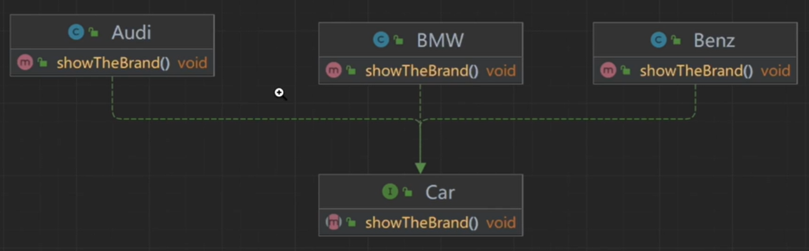
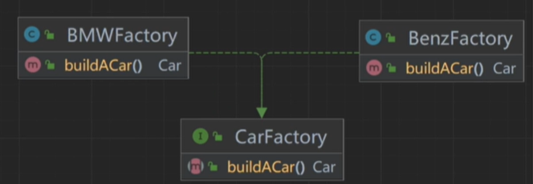
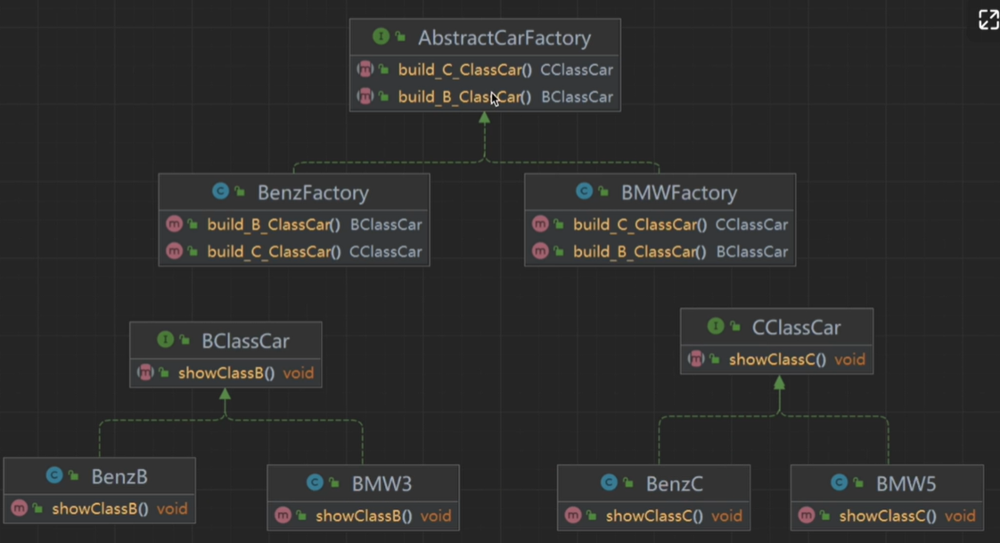
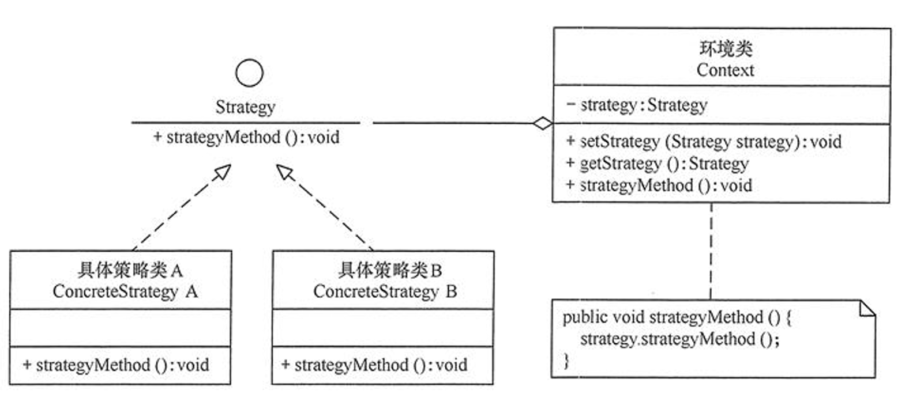
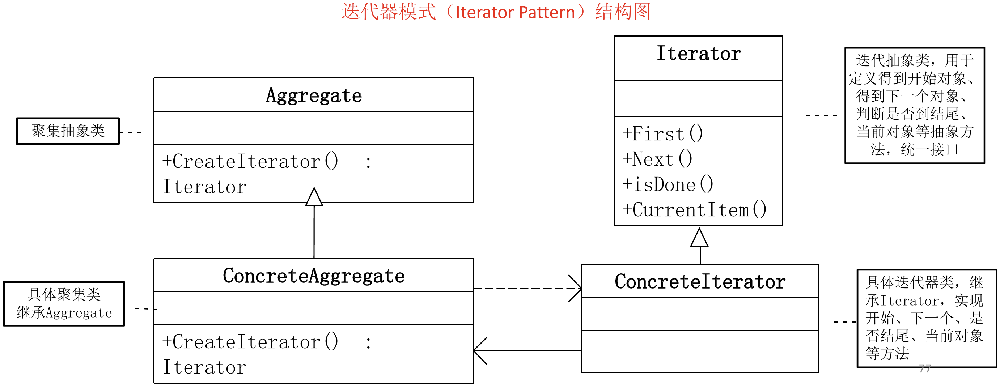

# <center>软件构造复习

## <center>设计模式

### 设计模式的分类
1. 按照目的来分
    - 创建型模式（工厂方法，抽象工厂，单例）
    - 结构型模式
    - 行为型模式（模板方法，迭代器，观察者，策略）
2. 根据范围来分
    - 类（工厂方法，模板方法）
    - 对象（抽象工厂，单例，迭代器，观察者，策略）

### <center>单例模式
**保证一个类仅有一个实例，并提供一个访问它的全局访问点**

#### （1）饿汉式
```
public class Singleton{
    private static Singleton singleton01 = new Singleton(); // 天然线程安全

    private Singleton{}

    public static Singleton getInstance(){
        return singleton01;
    }
}
```
缺点：会造成内存浪费。
#### （2）懒汉式
```
public class Singleton{
    private static Singleton singleton02;

    private Singleton(){}

    public statc Singleton getInstance(){
        if (singleton02 == NULL){
            singleton02 = new Singleton();
        }
        return singleton02;
    }
}
```
缺点：可能会创建多个实例。
**解决方法一：加入同步锁**
```
public class Singleton{
    private static Singleton singleton02;

    private Singleton(){}

    public static synchronized Singleton getInstance(){ // 线程安全，但是效率低
        if (singleton02 == NULL){
            singleton02 = new Singleton();
        }
        return singleton02;
    }
}
```
**解决方法二：双重检验锁**
```
public class Singleton{
    private static Singleton singleton02;

    private Singleton(){}

    public static Singleton getInstance(){
        if (singleton02 == NULL){
            synchornized (Singleton.class){
                if (singleton02 == NULL){
                    singleton02 = new Singleton();
                }
            }
        }
        return sigleton02;
    }
}
```
### <center>简单工厂模式

#### UML类图


#### 代码实现
```
public interface Car{
    void showTheBrand();
}
```
```
public class Audi implements Car{
    @override
    void showTheBrand(){
        system.out.println("Audi");
    }
} 
```
```
public class BMW implements Car{
    @override
    void showTheBrand(){
        system.out.println("BMW");
    }
} 
```
```
public class Benz implements Car{
    @override
    void showTheBrand(){
        system.out.println("Benz");
    }
} 
```
```
public class SimpleFactory{
    public static Car giveMeACar(String brandName){
        if ("BMW".equals(brandName)){
            return new BMW();
        }
        if ("Benz".equals(brandName)){
            return new Benz();
        }
        if ("Audi".equals(brandName)){
            return new Audi();
        }
        return null;
    }
}
```
### <center>工厂模式

#### UML类图
在简单工厂的基础上加上新的工厂：



#### 代码实现
```
public interface Car{
    void showTheBrand();
}
```
```
public class Audi implements Car{
    @override
    void showTheBrand(){
        system.out.println("Audi");
    }
} 
```
```
public class BMW implements Car{
    @override
    void showTheBrand(){
        system.out.println("BMW");
    }
} 
```
```
public class Benz implements Car{
    @override
    void showTheBrand(){
        system.out.println("Benz");
    }
} 
```
```
public interface CarFactory{
    Car buildACar();
}
```
```
public class BMWFactory implements CarFactory{
    @override
    Car buildACar(){
        return new BMW();
    }
}
```
```
public class BenzFactory implements CarFactory{
    @override
    Car buildACar(){
        return new Benz();
    }
}
```
```
public class AudiFactory implements CarFactory{
    @override
    Car buildACar(){
        return new Audi();
    }
}
```
```
public class FactoryTest{
    public static void main(String[] args){
        BMWFactory carfactory = new BMWFactory();
        Car mayCar = carFactory.buildACar();
        mayCar.showTheBrand();
    }
}
```
优点：
利于扩展和维护，比如新增加一种车，只需要对应创建具体产品类和负责生产新品种车的具体工厂即可。符合“开闭原则”，便于扩展。
缺点：
不支持等级。
### <center>抽象工厂模式
**主要用于解决“一类产品”的创建问题**，与工厂方法模式的区别：
1. 工厂方法模式只有一个抽象产品类，而抽象工厂模式有多个。
2. 工厂方法模式的具体工厂类只能创建一个具体产品类的实例，而抽象工厂模式可以创建多个。
#### UML类图

#### 代码实现
```
public interface AbstractCarFactory{
    BClassCar build_B_ClassCar();
    CClassCar build_C_ClassCar();
}
```
```
public interface BClassCar{
    void showClassB();
}
```
```
public interface CClassCar{
    void showClassC();
}
```
具体实现省略
```
public class AbtractFactoryTest{
    public static void main(String[] args){
        BMWFactory bmwFactory = new BMWFactory();
        BenzFactory benzFactory = new benzFactory();

        bmwFactory.build_B_ClassCar().showClassB();
    }
}
```
优点：
1. 隔离了具体类的生成，将创建和使用解耦。
2. 添加新的产品族很方便，无需修改已有系统，符合“开闭原则”。
缺点：
1. 增加新的产品等级很麻烦，违背了“开闭原则”。

### <center>策略模式
**定义一系列的算法,把每一个算法封装起来, 并且使它们可相互替换，从而使得算法可独立于使用它的客户而变化。并将逻辑判断移到Client中去（即由客户端决定在什么情况下使用什么具体策略）。**

策略模式的三个基本角色：
1. 抽象策略角色：通常由一个接口或抽象类实现，此角色给出所有的具体策略类所需要的接口。
2. 具体策略角色：包装了相关算法或行为。
3. 环境角色：持有一个策略的引用。

#### UML类图


#### 代码实现
例子：假设现在要设计一个卖书的电子商务网站，本网站可能对所有的高级会员提供每本20％的促销折扣；对中级会员提供每本10％的促销折扣；对初级会员没有折扣。根据描述，折扣是根据以下的几个算法中的一个进行的：
- 算法一：对初级会员没有折扣。
- 算法二：对中级会员提供10％的促销折扣。
- 算法三：对高级会员提供20％的促销折扣。
```
//抽象策略类
public interface MemberStrategy{
    public double calcPrice(double booksPrice);
}
```
```
//具体策略1
public class PrimaryMemberStrategy implements MemberStrategy{
    @override
    public double clacPrice(double booksPrice){
        return booksPrice;
    }
}
```
```
//具体策略2
public class IntermediateMemberStrategy implements MemberStrategy{
    @override
    public double clacPrice(double booksPrice){
        return 0.9 * booksPrice;
    }
}
```
```
//具体策略3
public class AdvancedMemberStrategy implements MemberStrategy{
    @override
    public double clacPrice(double booksPrice){
        return 0.8 * booksPrice;
    }
}
```
```
public class Network { //持有一个具体的策略对象 
    private MemberStrategy strategy; 
    public Network(MemberStrategy strategy){ 
        this.strategy = strategy; 
    } 

    public double quote(double booksPrice){   
        return this.strategy.calcPrice(booksPrice); 
    } 
} 
```
```
public class Client{
    public static void main(Srting[] args){
        MemberStrategy strategy = new AdvancedMemberStrategy();
        Network network = new Network(strategy);
        double quote = network.quote(300);
        System.out.println(quote);
    }
}
```
优点：
- 提供了一种替代继承的方法，而且既保持了继承的优点（代码重用）还比继承更灵活（算法独立，可以任意扩展）。
- 它把采取哪一种算法或采取哪一种行为的逻辑与算法本身分离，避免程序中使用多重条件转移语句，使系统更灵活，并易于扩展。
- 遵守大部分设计原则，高内聚、低偶合。
  
缺点：
- 客户端必须知道所有的策略类，并自行决定使用哪一个策略类。这就意味着客户端必须理解这些算法的区别，以便适时选择恰当的算法类。换言之，策略模式只适用于客户端知道算法或行为的情况。
- 由于策略模式把每个具体的策略实现都单独封装成为类，如果备选的策略很多的话，那么对象的数目就会很可观。

### <center>迭代器模式
**在客户访问类与聚合类之间插入一个迭代器，这分离了聚合对象与其遍历行为，对客户也隐藏了其内部细节，且满足“单一职责原则”和“开闭原则”。**
提供一种方法顺序访问一个聚合对象中各个元素, 而又无须暴露该对象的内部表示。
#### UML类图

